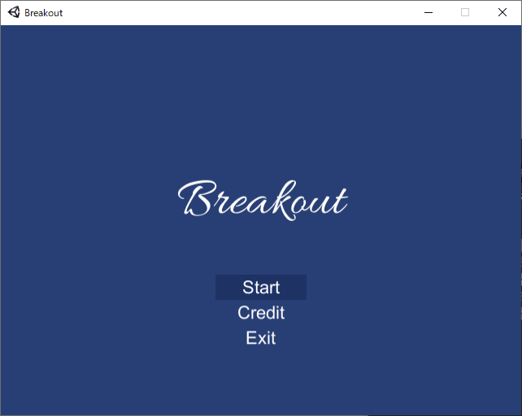

# Breakout

Unity製ブロック崩しです。

## 説明

Breakoutは、Unityで開発しているシンプルなブロック崩しです。

## 対応プラットフォーム

### PC

- OS: Windows 7 SP1以降（64bit）
- CPU: x64
- 解像度: 640x480以上

### Android

- OS: Android 5.0以降
- CPU: ARM64
- 解像度: 640x480以上

### Web

- ブラウザ: Chrome/Edge/Firefox/Safari最新版（デスクトップ）
- 解像度: 960x600以上

## 使い方

### インストール方法

1. [Release](https://github.com/finphie/Breakout/releases)から対応したファイルをダウンロード
1. Breakout.exe（PC）/Breakoutアプリ（Android）/index.html（Web）を実行

### アンインストール方法

ダウンロードしたファイルを削除してください。

### 操作方法

キーボードやマウス、タッチ操作に対応しています。

キー|ゲーム画面|タイトル・リザルト画面|クレジット画面
:-:|:-:|:-:|:-:
↑↓←→|パドルを移動|選択|スクロール
WASD|パドルを移動|選択|スクロール
Enter（PC/Web）|-|決定|戻る
Esc（PC）|-|-|戻る
戻る（Android）|-|-|戻る
F11（PC）|-|全画面表示の切り替え|-
左クリック|パドルを移動|決定|-
タップ|パドルを移動|決定|-
スワイプ|-|-|スクロール

## 使用言語

- C# 7.3

## 開発環境

- Visual Studio 2019
- Visual Studio Code
- Unity 2019.2.9f1

## 作者

finphie

## ライセンス

MIT

## クレジット

このプロジェクトでは、下記のライブラリを使用しています。

### フォント

- [Allura](https://fonts.google.com/specimen/Allura)